# 驻村帮扶管理系统

  <strong>专为驻村工作队打造的数字化帮扶管理平台</strong> 
  Windows 绿色免安装 &middot; 双击即用 &middot; 局域网多用户共用

  
  
  

---
## 写在前面的话
驻村330天了。最深的体会是：手写笔记太累而且根本不够用。
入户走访拍完照、回来补记录，过几天还是不认识人。
政策宣讲、产业规划、党建台账、迎检材料，还有村民随时上门，一堆事摞在一起，笔记本早就不堪重负。
于是一个驻村干部做了个“不务正业”的决定：自己开发一套驻村帮扶管理系统。
写这段代码的时候我就在想，驻村工作本来就够累的了，如果这套系统真能让日常留痕、入户走访、档案查阅
这些事省点力气，那我这玩意就没白弄。也算不辜负这段在村里的日子——既能把本职工作干扎实，又能留下点真正有用的东西。

如果各位要用这套系统，觉得哪些功能不符合你们的习惯，或者这套系统不符合你们那边驻村工作的要求，
我给你的建议是：
1.下载源代码文件；
2.本地安装vscode；
3.本地安装workbuddy；
4.将workbuddy的工作区设置为源代码文件夹；
5.让workbuddy读懂源代码；
6.你想要啥就跟workbuddy说去吧！它会帮你写好代码的！
注：我用的是claude code ^_^ 很多不会的东西都是它来帮我补全的。就说这么多吧。字多，挺累的。
2026/5/26

## 快速开始

| 步骤 | 操作 |
|:----:|------|
| 1 | [下载最新版](../../releases/latest) `village-system-V2.3.zip` |
| 2 | 双击 `系统自检.bat`，按提示移动文件夹 |
| 3 | 双击 `启动系统.bat`，浏览器自动打开 |
| 4 | 登录 `admin` / `admin123` |

## 功能模块

<table>
<tr>
<td width="50%"><strong>智能工作台</strong> 驻村天数统计、快捷入口、一屏总览</td>
<td width="50%"><strong>农户管理</strong> 12 标签属性、家庭成员、批量导入导出</td>
</tr>
<tr>
<td>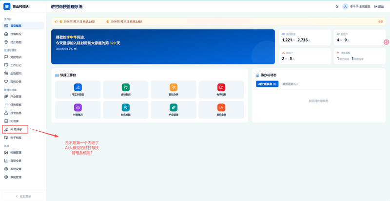</td>
<td>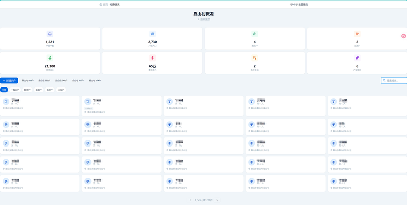</td>
</tr>
<tr>
<td><strong>走访慰问</strong> 入户记录、照片上传、HEIC 自动转 JPEG</td>
<td><strong>党建培训</strong> 三会一课、主题党日、党员信息管理</td>
</tr>
<tr>
<td>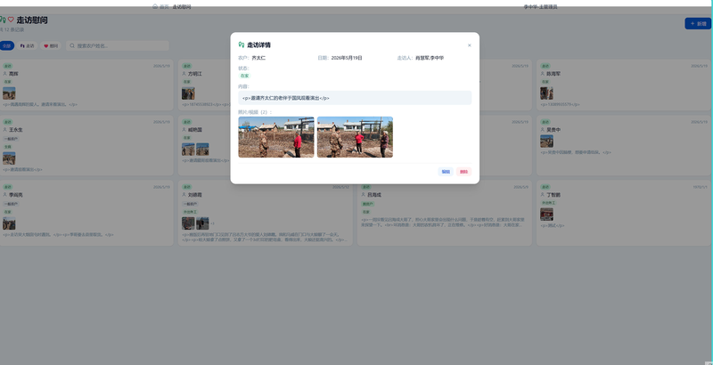</td>
<td>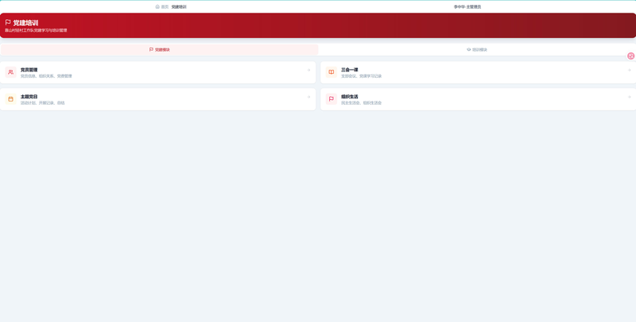</td>
</tr>
<tr>
<td><strong>履职全景</strong> 四项职责十项任务进度追踪</td>
<td><strong>产业管理</strong> 帮扶项目全流程管理</td>
</tr>
<tr>
<td>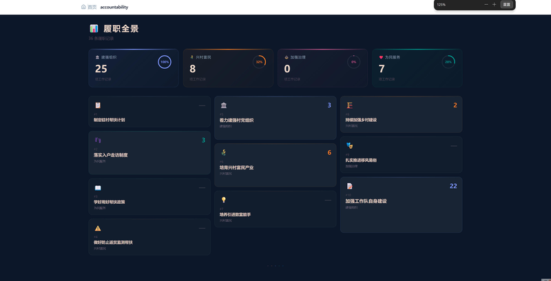</td>
<td>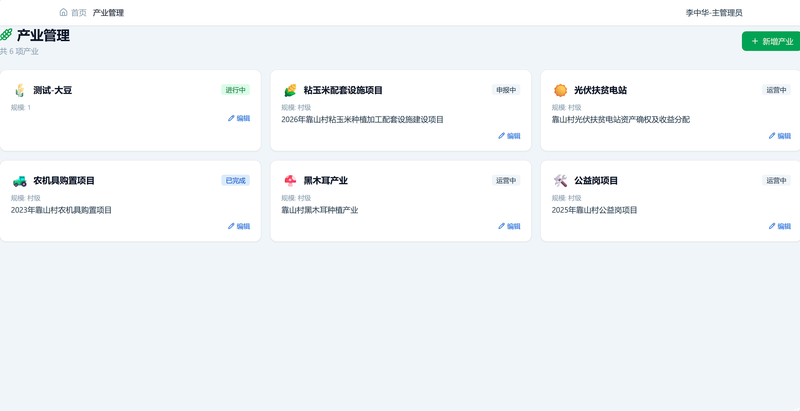</td>
</tr>
<tr>
<td><strong>防返贫预警</strong> 监测预警、风险研判、帮扶跟进</td>
<td><strong>百姓办事</strong> 标签系统、村民搜索、照片附件</td>
</tr>
<tr>
<td>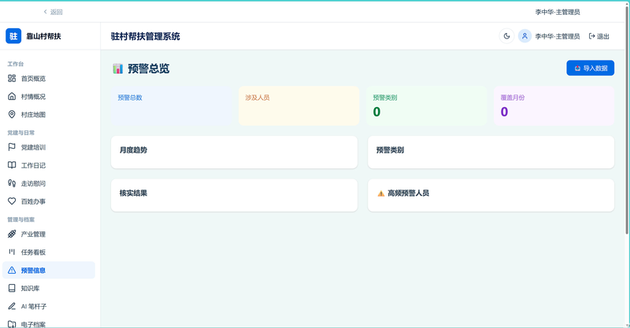</td>
<td>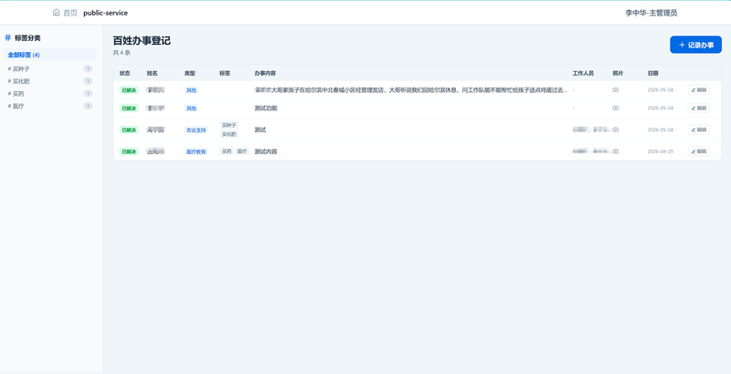</td>
</tr>
<tr>
<td><strong>驻村日记</strong> 工作日志、图文记录、私密模式</td>
<td><strong>档案管理</strong> 电子文档分类存储、在线预览</td>
</tr>
<tr>
<td></td>
<td>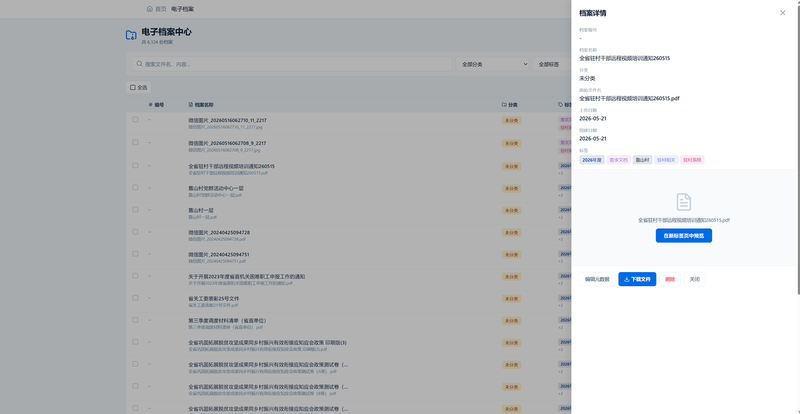</td>
</tr>
<tr>
<td><strong>项目看板</strong> 任务进度可视化追踪</td>
<td><strong>培训记录</strong> 培训档案、学习记录管理</td>
</tr>
<tr>
<td></td>
<td>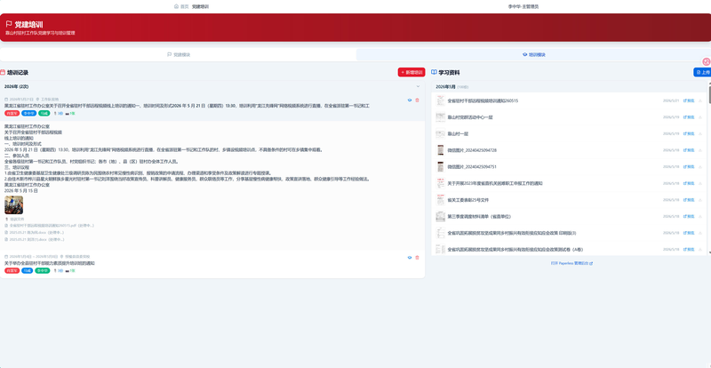</td>
</tr>
<tr>
<td><strong>地图标记</strong> 村内地点标注、信息录入</td>
<td><strong>AI 笔杆子</strong> 工作总结、汇报材料自动生成</td>
</tr>
<tr>
<td>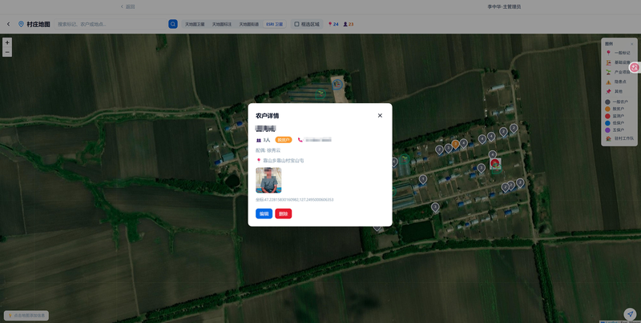</td>
<td>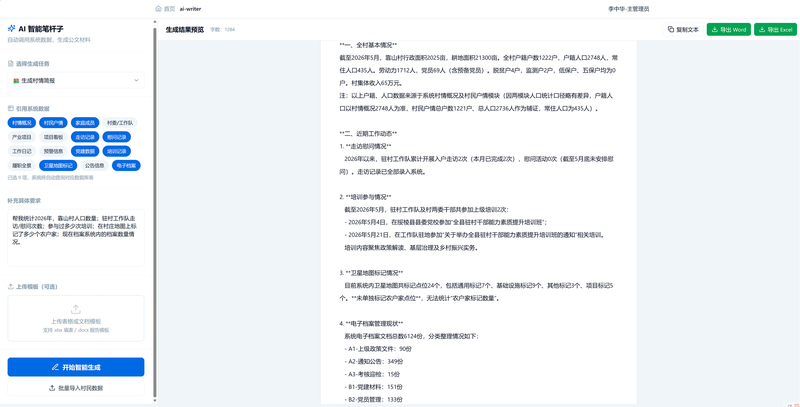</td>
</tr>
<tr>
<td><strong>知识库</strong> 政策文件、办事指南集中管理</td>
<td><strong>相册管理</strong> 图片上传、分类浏览</td>
</tr>
<tr>
<td>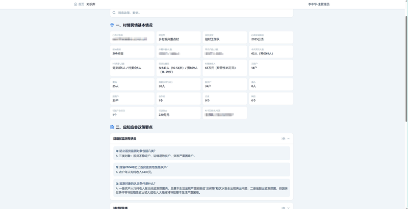</td>
<td>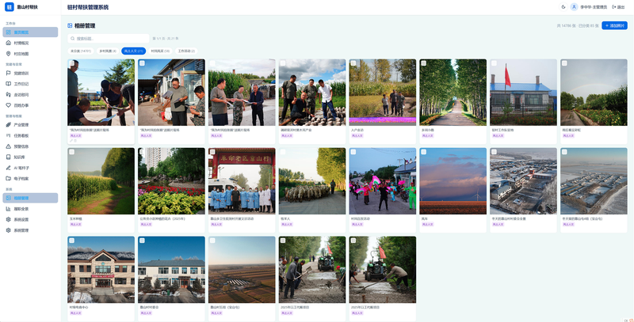</td>
</tr>
</table>

## 亮点

- **零门槛** — 无需安装数据库或服务器，内置 Node.js 便携版
- **局域网共享** — 一台电脑启动，同网队员都能访问
- **自检诊断** — 双击 `系统自检.bat`，自动检测环境问题
- **数据导入** — Excel 批量导入村民户、家庭成员、党员信息，自动判重
- **身份证校验** — 18 位格式 + 校验码自动验证

## 常见问题

| 问题 | 解答 |
|------|------|
| 打不开页面？ | 运行 `系统自检.bat`，查看端口是否被占用 |
| 忘记密码？ | 联系管理员重置 |
| 如何备份？ | 系统设置 → 一键备份，或直接复制 `data/` 文件夹 |
| 多人同时用？ | 一台电脑启动服务，局域网内其他电脑通过 IP 访问 |

## 技术栈

Next.js 14 · TypeScript · Prisma · SQLite · NextAuth.js · Tailwind CSS

---

黑龙江省机关事务管理局驻村工作队 队员李中华 @2026
